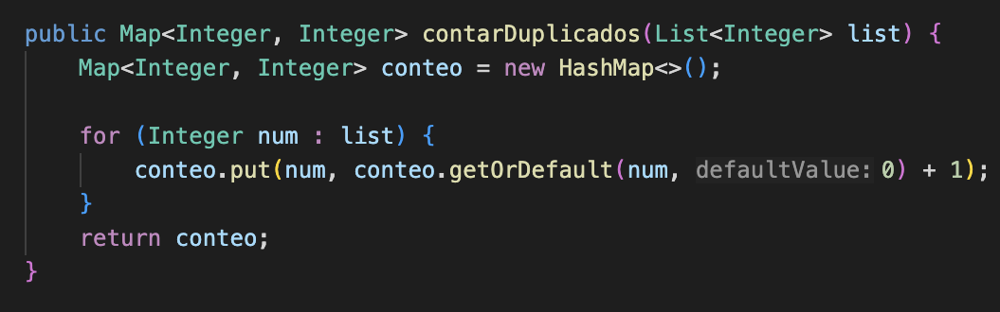
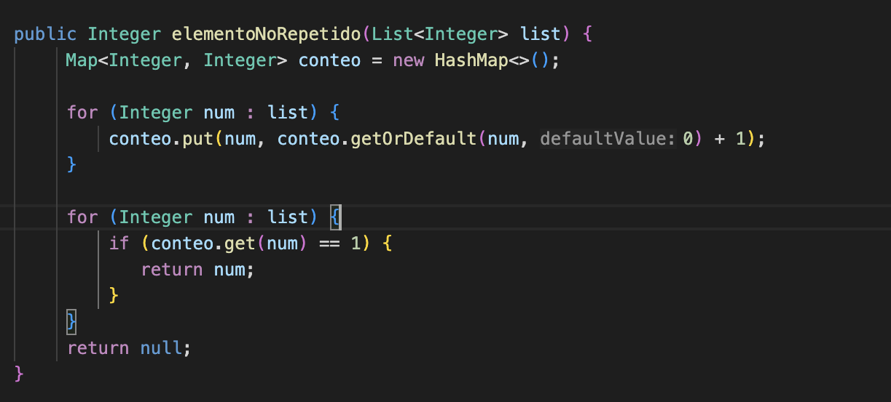
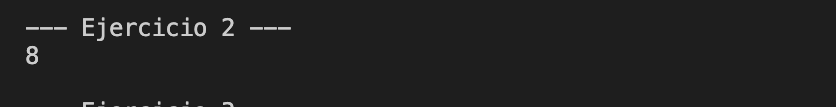
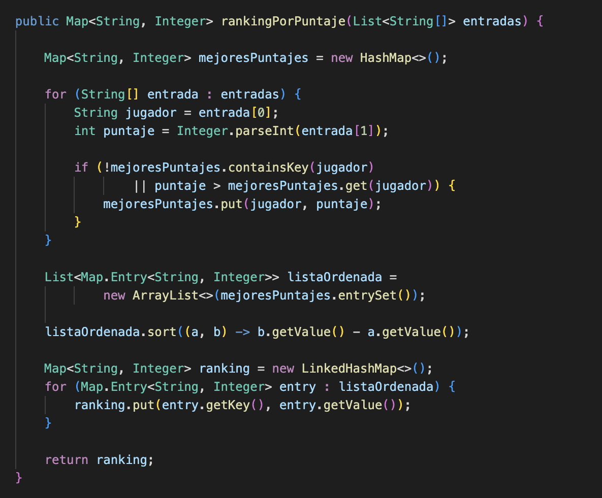
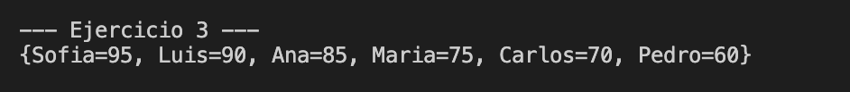
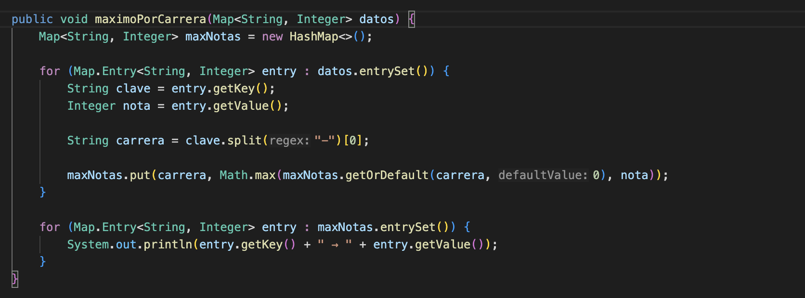

# Práctica: Ejercicios con mapas

## Autor
- Nombre: Erika Collaguazo
- Carrera/Curso: Estructura de datos

##  Nombre de la práctica - Fecha
- Práctica:  Maps Ejercicisios
- Fecha: 2026-01-19

## Descripción
En esta práctica se desarrollaron varios ejercicios utilizando la estructura de datos Map en Java, con el objetivo de fortalecer la lógica de programación y el manejo de colecciones. Se aplicaron diferentes tipos de mapas para resolver problemas como el conteo de elementos duplicados, la identificación del primer elemento no repetido, la generación de rankings por puntaje y el cálculo de la nota máxima por grupo o carrera.

## Evidencias
### Captura 1 
Se implementó un algoritmo que recibe una lista de números enteros y utiliza un HashMap para contar cuántas veces se repite cada número. La clave del mapa representa el número y el valor indica la cantidad de apariciones.

### Captura 2 
En este ejercicio se determinó el primer elemento que no se repite dentro de una lista, respetando el orden original. Para ello, primero se contó la frecuencia de cada número usando un HashMap y luego se recorrió nuevamente la lista para identificar el primer valor con frecuencia igual a uno.

### Captura 3
Este ejercicio consistió en mantener únicamente el mayor puntaje por jugador y generar un ranking ordenado de forma descendente. Se utilizó un HashMap para almacenar el mejor puntaje de cada jugador y posteriormente un LinkedHashMap para conservar el orden del ranking después de ordenar los resultados.

### Captura 4 
En este ejercicio se calculó la nota máxima por carrera. La clave del mapa tiene el formato Carrera-Nombre, y a partir de esta se extrajo la carrera para comparar y almacenar únicamente la nota más alta correspondiente a cada una, utilizando la función Math.max.

